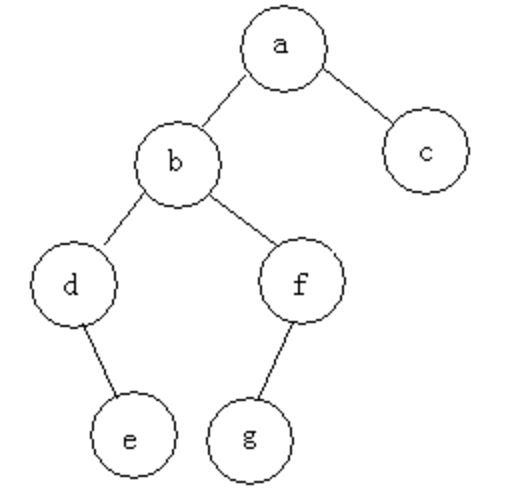

说明：

     前序遍历：a b d e f g c
     中序遍历：d e b g f a c
     后序遍历：e d g f b c a
     后序遍历：a b c d f e g
         
         
参考：         
http://blog.csdn.net/fansongy/article/details/6798278

http://www.cnblogs.com/dolphin0520/archive/2011/08/25 /2153720.html

http://blog.csdn.net/anonymalias/article/details/10897009